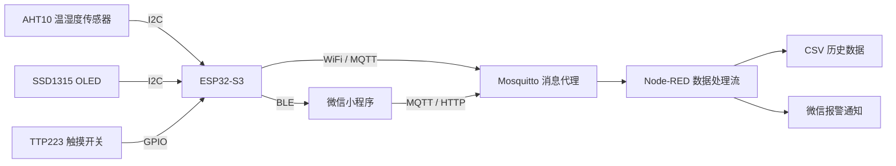

# 温湿度传感器 Temperature-and-humidity-sensor
这是我的本科毕业设计，基于微信小程序的温湿度监测系统。主体基于esp32-s3 supermini，通过蓝牙或wifi连接微信小程序，实现温湿度的远程查询、阈值报警、历史数据查看等功能。
> Temperature and Humidity Monitoring System Based on WeChat Mini Program


基于 **ESP32-S3 + AHT10** 的物联网温湿度监测系统，以**微信小程序**作为上位机，通过**蓝牙**完成设备配网与本地参数配置，通过 **WiFi + MQTT** 实现远程数据上报与实时监测，配合 **Node-RED + Mosquitto** 服务器完成数据持久化、历史查询与微信报警推送。

低成本、高集成、易部署的远程温湿度监测解决方案，适用于农业大棚、仓储库房、机房、智能家居等场景。

---

## 项目简介 / Introduction

传统温湿度监测方式存在布线复杂、交互性差、专用客户端适配繁琐等问题，难以满足远程智能监测需求。本项目打造一套完整闭环的物联网监测系统，采用**硬件采集层 → 无线通信层 → 服务器层 → 小程序应用层**的四层架构，覆盖"采集 — 传输 — 存储 — 交互"全链路：

- **硬件采集层**：以 ESP32-S3 为主控，搭配 AHT10 高精度温湿度传感器与 OLED 显示屏，完成数据采集与本地可视化；
- **无线通信层**：蓝牙负责近场配置（配网、参数下发），WiFi 负责远程数据传输（MQTT 上报）；
- **服务器层**：部署 Mosquitto 消息代理与 Node-RED 数据处理流，实现数据持久化、历史查询接口与微信通知推送，并通过内网穿透提供公网访问；
- **应用层**：微信小程序提供设备管理、实时监测、参数设置、历史数据查询等可视化交互。

## 功能特性 / Features

- 📊 **实时监测**：ESP32 双核并行采集，数据经 MQTT 实时上报，小程序同步展示温湿度数值与动态曲线
- 📡 **双模通信**：蓝牙 BLE（近场配置与数据传输）+ WiFi（远程上报与服务器通信）
- 🔧 **蓝牙配网**：无需将 WiFi 账号密码写死在固件中，小程序内直接下发 SSID / 密码完成入网
- 🚨 **阈值报警**：温度、湿度上下限均可配置，超限即时上报，服务器向用户微信推送报警通知
- 🗂️ **历史数据**：服务端按日持久化为 CSV 文件，小程序按日期查询并绘制历史曲线
- 🔗 **多设备管理**：蓝牙扫描绑定、多设备列表、断线自动重连
- 🖥️ **本地可视化**：0.96 寸 OLED 实时显示温湿度、通信状态与阈值信息
- 💾 **参数持久化**：全部配置写入 Flash（Preferences），掉电复位不丢失
- 🔋 **低功耗设计**：联网成功后自动关闭蓝牙，触摸唤醒 + 定时熄屏

## 系统架构 / Architecture

```
┌────────────────────────────────────────────────────────────────┐
│                    微信小程序（应用层）                             │
│   设备总览 · 实时监测 · 参数设置 · 历史数据 · 个人中心                   │
└───────────┬──────────────────────────────────┬──────────────────┘
            │ MQTT over WebSocket              │ HTTP
            │ 实时数据订阅                        │ 历史 CSV 查询
┌───────────▼──────────────────────────────────▼──────────────────┐
│           服务器层（Mosquitto + Node-RED）                         │
│   数据接收转发 · CSV 持久化 · HTTP 查询接口 · 微信报警通知              │
└───────────┬─────────────────────────────────────────────────────┘
            │ MQTT over TCP
┌───────────▼─────────────────────────────────────────────────────┐
│        无线通信层（ESP32 双模）                                     │
│   蓝牙 BLE（近场配置 / 指令下发）   WiFi（远程数据上传）                 │
└───────────┬─────────────────────────────────────────────────────┘
            │ I2C
┌───────────▼─────────────────────────────────────────────────────┐
│        硬件采集层（ESP32-S3 + AHT10 + OLED + 触摸开关）              │
└─────────────────────────────────────────────────────────────────┘
```



核心数据链路：硬件采集温湿度 → WiFi / MQTT 上传至服务器存储 → 小程序通过 MQTT 获取实时数据、通过 HTTP 查询历史数据 → 小程序指令经蓝牙下发至硬件，实现双向交互。

## 技术栈 / Tech Stack

| 层级 | 技术 |
| --- | --- |
| 硬件 | ESP32-S3 Supermini、AHT10、SSD1315 OLED、TTP223 触摸开关 |
| 固件 | Arduino C、ESP32 双核任务调度、BLE、PubSubClient、Preferences |
| 服务器 | Mosquitto（MQTT Broker）、Node-RED、CSV、内网穿透 |
| 客户端 | 微信小程序原生开发（WebSocket 手写 MQTT 3.1.1 报文、Canvas 图表） |

## 目录结构 / Project Structure

```
Temperature-and-humidity-sensor
├── main_BLE_WiFi_MQTT_DualCore_NoEEPROM_Set.ino   # ESP32-S3 固件（Arduino）
└── wxamp_main/                                    # 微信小程序
    ├── app.js / app.json / app.wxss                # 全局逻辑、页面与样式配置
    ├── pages/
    │   ├── equipment/                              # 设备总览（蓝牙扫描 / 连接）
    │   ├── detailed/                               # 实时监测详情（数值 + 动态曲线）
    │   ├── detailed/detaileddaily/                 # 历史数据查询
    │   ├── setpage/                                # 参数设置入口
    │   │   ├── equwifi/                            # WiFi 配网
    │   │   ├── equalarm/                           # 温湿度告警阈值
    │   │   ├── equnickname/                        # 设备昵称
    │   │   ├── equdetailed/                        # 设备详情
    │   │   ├── equadd/                             # 添加设备
    │   │   └── otherset/                           # 其他设置
    │   ├── my/                                     # 个人中心（含通知、通用、帮助）
    │   ├── login/                                  # 用户登录
    │   └── canvasfortime/                          # 图表绘制
    ├── icons/                                      # 界面图标资源
    ├── utils/                                      # 工具函数（MQTT 封装、格式化等）
    └── date-csv/                                   # 历史数据文件示例
```

## 硬件设计 / Hardware Design

系统以**高集成度、低功耗、易调试**为选型原则，采用模块化连接设计，通过 SH1.0 接口实现各外设与主控的可靠对接，并由主控板提供 3.3V 供电。

### 硬件清单

| 模块 | 型号 | 说明 |
| --- | --- | --- |
| 主控 | ESP32-S3 Supermini | WiFi + BLE 双模、双核 240MHz，Type-C 供电与程序烧录 |
| 温湿度传感器 | AHT10 | I2C 通信，温度 -40~85℃（±0.3℃），湿度 0~100%RH（±2%RH），宽电压 1.8~6.0V |
| 显示屏 | SSD1315 0.96" OLED | I2C 128×64，本地数据与状态可视化 |
| 触摸开关 | TTP223 | 低电平触发屏幕唤醒，降低功耗 |
| 外壳 | 3D 打印（上下卡扣式） | 一体化成品，提升防护与质感 |
| PCB | 嘉立创 EDA 定制 | 紧凑化、模块化、易装配，SH1.0 贴片接口 |

### 引脚连接

| 外设 | 引脚 / 地址 | 说明 |
| --- | --- | --- |
| I2C SDA | GPIO8 | AHT10 与 OLED 共用 |
| I2C SCL | GPIO9 | AHT10 与 OLED 共用 |
| AHT10 | I2C 地址 `0x38` | 温湿度采集 |
| OLED | I2C 地址 `0x3C` | 本地显示 |
| 触摸开关 | GPIO13 | 屏幕唤醒触发 |

### 固件默认配置

| 配置项 | 默认值 |
| --- | --- |
| 设备广播名 | `ESP32-TH-V2` |
| 默认设备昵称 | `温湿度传感器V2.1` |
| 温度告警阈值 | 0 ~ 30℃ |
| 湿度告警阈值 | 0 ~ 80%RH |
| 采样 / 上报间隔 | 2000 ms |
| 熄屏时间 | 0（常亮） |
| NTP 服务器 | `ntp.aliyun.com`（UTC+8） |

## 通信协议 / Communication Protocols

### MQTT 主题

| 主题 | 方向 | 说明 |
| --- | --- | --- |
| `home/sensor/th` | 设备 → 服务器 | 实时温湿度数据上报 |
| `home/alarm/th` | 设备 → 服务器 | 阈值报警消息 |
| `device/online` | 设备 → 服务器 | 设备上线状态 |

实时数据上报格式（JSON）：

```json
{
  "time": "2026-03-15 10:00:00",
  "UUID": "<设备唯一标识>",
  "Nickname": "客厅传感器",
  "Location": "客厅",
  "temp": 25.3,
  "humi": 45.6
}
```

小程序端通过 WebSocket 连接 MQTT Broker（如 `ws://<服务器地址>:<端口>/mqtt`），手写 MQTT 3.1.1 报文完成连接与主题订阅，无需第三方库，并支持断线退避重连。

### 蓝牙 BLE

- **服务 UUID / 特征 UUID**：定义于固件头部（`SERVICE_UUID` / `CHARACTERISTIC_UUID`），小程序按服务 UUID 前缀匹配
- **特征属性**：READ + WRITE + NOTIFY + INDICATE，MTU 512
- **实时数据广播格式**：`温度,湿度`（如 `25.3,45.6`）

### 蓝牙指令集

| 指令 | 功能 | 回复 |
| --- | --- | --- |
| `WIFI:<ssid>,<password>` | 下发 WiFi 配网信息 | `WIFI_OK` / `WIFI_FORMAT_ERR` |
| `TEMP:<lower>,<upper>` | 设置温度告警阈值 | `TEMP_OK:<lower>,<upper>` |
| `HUM:<lower>,<upper>` | 设置湿度告警阈值 | `HUM_OK:<lower>,<upper>` |
| `NICK:<名称>` | 设置设备昵称（UTF-8） | `NICK_OK` / `NICK_FAIL` |
| `LOC:<位置>` | 设置安装位置 | `LOC_OK` / `LOC_FAIL` |
| `MQTT:<server>,<port>` | 设置 MQTT 服务器 | `MQTT_OK` / `MQTT_FAIL` |
| `REFRESH:<ms>` | 设置采样 / 上报间隔（500~30000 ms） | `REFRESH_OK` / `REFRESH_FAIL` |
| `SCREEN:<ms>` | 设置熄屏时间（0=常亮） | `SCREEN_OK` |
| `GET_CONFIG` | 读取全部配置 | `TEMP|HUM|NICK|LOC|MQTT|REFRESH|SCREEN` |
| `CLEAR` | 清除全部配置并恢复默认 | `CLEAR_OK` |

### HTTP 历史数据接口

```
GET /<设备UUID>/<YYYY-MM-DD>.csv
```

服务端返回按 `日期 时间 温度 湿度` 排列的 CSV 文件，小程序本地解析并绘制历史曲线。

## 快速开始 / Quick Start

### 1. 烧录固件（ESP32-S3）

1. 安装 Arduino IDE（或 PlatformIO），并安装 ESP32 开发板支持包；
2. 安装依赖库：`U8g2lib`、ESP32 BLE 库、`PubSubClient`、`Preferences`；
3. 按需修改固件头部配置：MQTT 服务器地址与端口、NTP 服务器（默认 `ntp.aliyun.com`，时区 UTC+8）等，也可通过小程序蓝牙指令动态下发；
4. 使用 Type-C 连接开发板，选择对应串口编译烧录。

### 2. 搭建服务器（远程监测依赖）

1. 部署 **Mosquitto** MQTT 消息代理，开放 TCP 端口（设备上报）与 WebSocket 端口（小程序订阅）；
2. 导入 **Node-RED** 数据处理流，包含四条核心流程：
   - 订阅 MQTT 设备主题 → 按 `<UUID>/<日期>.csv` 规则持久化存储；
   - HTTP GET 查询接口 → 读取并返回历史 CSV 文件；
   - 用户登录 → 获取并存储微信 OpenID；
   - 报警主题 → 触发微信通知推送；
3. 使用内网穿透工具（如 cpolar）将 MQTT、Node-RED 等端口映射到公网，实现设备与小程序跨网络稳定通信。

### 3. 运行微信小程序

1. 使用微信开发者工具导入 `wxamp_main` 目录；
2. 填入小程序 AppID，并配置以下服务器地址：
   - MQTT over WebSocket 地址（如 `ws://<服务器地址>:<端口>/mqtt`）；
   - HTTP 历史数据接口地址；
3. 编译预览。蓝牙扫描、配网等功能需在真机上测试。

## 使用指南 / Usage Guide

1. **添加设备**：设备总览页点击"+"，扫描并绑定附近的温湿度传感器；
2. **蓝牙配网**：进入设置页 WiFi 选项，下发 WiFi 名称与密码，设备自动联网并连接 MQTT 服务器；
3. **实时监测**：详情页以数值与动态曲线双形式展示温湿度，更新频率与设备采样周期一致；
4. **参数配置**：通过蓝牙可调整告警阈值、设备昵称、安装位置、采样间隔、熄屏时间等；
5. **历史查询**：历史数据页选择日期，小程序请求 CSV 并绘制当日温湿度曲线；
6. **阈值报警**：数据越限后设备上报报警消息，服务器向用户微信推送通知；
7. **登录授权**：个人中心支持头像、昵称设置与微信通知授权。

## 技术亮点 / Highlights

- **双核任务调度**：核心 1 独立完成 NTP 时间同步与 MQTT 连接，避免网络阻塞核心 0 的采集与显示流程；
- **原生 WebSocket 实现 MQTT**：小程序端手写 MQTT 3.1.1 报文（CONNECT / SUBSCRIBE / PUBLISH 解析），零第三方依赖，支持断线退避重连；
- **动态配网**：WiFi 凭证经蓝牙下发，账号密码不再写死在固件中；
- **参数持久化**：基于 Preferences（NVS Flash）替代 EEPROM，断电复位后配置不丢失；
- **省电策略**：WiFi 与服务器连接成功后自动关闭蓝牙；触摸唤醒 + 定时熄屏；
- **成品化落地**：定制 PCB + 3D 打印外壳，完成从模块化调试到一体化成品的全流程。

## 测试与验证 / Testing

- **功能测试**：蓝牙扫描 / 绑定、WiFi 配网、MQTT 实时数据、参数下发、历史查询、阈值报警推送均通过验证；
- **精度验证**：小程序显示数据与硬件 OLED 显示完全一致，采集误差满足传感器标称精度；
- **稳定性测试**：长时间运行无断连、死机、数据错乱，满足农业、仓储、家居等多场景监测需求。

## 应用场景 / Use Cases

- 🌱 农业大棚温湿度监测
- 📦 仓储库房环境监控
- 🖥️ 机房 / 设备间环境保障
- 🏠 智能家居环境感知
- 📷 摄影器材、贵重物品防潮监测

## 开源许可 / License

本项目仅供学习、毕业设计参考使用。
